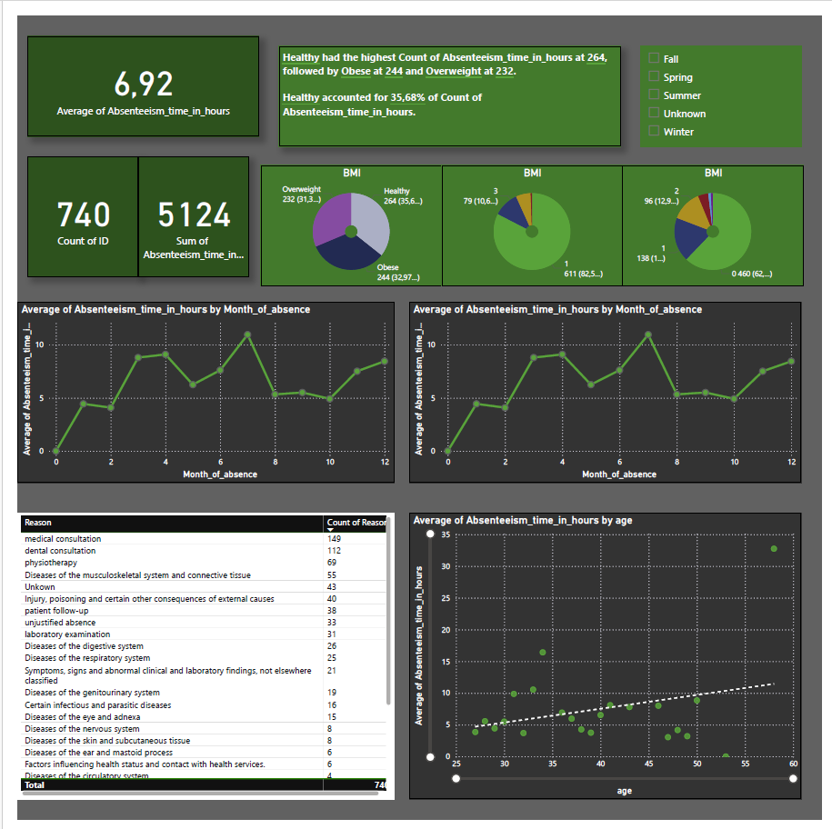

# Project Overview

HR aims to reward healthy employees and analyze absenteeism. This project includes:

💪 Healthy Bonus Program: Identify healthy individuals with low absenteeism, distributing a total of $1,000 USD among them.

🚭 Non-Smoker Compensation: Allocate an  compensation increase for non-smokers within a $983,221 USD budget.

📊 Absenteeism Dashboard: Build a dashboard (per approved wireframe) to visualize and analyze workplace absenteeism.

## Data 📁 + 📄


### 📄 [Absenteeism_at_work](Tables/Absenteeism_at_work.csv)
**Description:** csv file with information about the employees absenteeism and their health habits.


### 📄 [Reason](Tables/Reasons.csv)
**Description:** csv file with information about the reasons for absenteeism.


### 📄 [compensation](Tables/compensation.csv)
**Description:** csv with file with information about the compensation for every employee.

## [SQL Query 📝](Absenteeism%20query.sql)
### 💪 Healthy Bonus Program
The criteria I used to identify healthy employees with low absenteeism was:

- BMI between 24.9 and 18.5

- Non-smoker

- Non-drinker

- Absenteeism time in hours lower than average.

The next query filters by this criteria, giving us a list of 125 ID's.

```sql
select ID
from Absenteeism_at_work
where Body_mass_index<24.9 and Body_mass_index>18.5
and Social_drinker=0 and Social_drinker=0 and
Absenteeism_time_in_hours<(select AVG(Absenteeism_time_in_hours) from Absenteeism_at_work)
```
We have a budget of $1000 USD, so $1000/125=$8 for everyone in the list.

### 🚭 Non-Smoker Compensation

The next query counts the amount of non-smokers. Wich is 686

```sql
select count(ID)
from Absenteeism_at_work
where Social_smoker=0;
```

- Non-smokers counted: 686

- Assumptions: 8 hours/day, 5 days/week, 52 weeks/year → 2,080 hours/year per worker

- Total hours: 686 × 2,080 = 1,426,880 hours

- Hourly increase: $983,221 ÷ 1,426,880 ≈ $0.69/hour

Each non-smoker receives approximately $0.69 per hour as part of the annual compensation increase.

### 📊 Absenteeism Dashboard

In this last query, I join tables to get a full table with all the information I'll need for data visualization. I 
also created new categorys like **Season** and **BMI_category** to easily filter in PowerBI.

```sql
select a.ID,Reason,Month_of_absence,
case
when Month_of_absence in (12,1,2) then 'Winter'
when Month_of_absence in (3,4,5) then 'Spring'
when Month_of_absence in (6,7,8) then 'Summer'
when Month_of_absence in (9,10,11) then 'Fall'
else 'Unknown'end as Season,
case
when Body_mass_index < 18.5 then 'Underweight'
when Body_mass_index >=18.5 and Body_mass_index<=24.9 then 'Healthy'
when Body_mass_index >24.9 and Body_mass_index<=29.9 then 'Overweight'
when Body_mass_index >29.9 then 'Obese'
else 'Unknown' end as BMI_category,Body_mass_index,
Day_of_the_week,Transportation_expense,Distance_from_Residence_to_Work,
Service_time,age,Work_load_Average_day,Hit_target,Disciplinary_failure,Education,
Son,Social_drinker,Social_smoker,Pet,Absenteeism_time_in_hours,Height,Weight,comp_hr
from Absenteeism_at_work as a
left join compensation as c
on a.ID=c.ID
left join Reasons as r
on a.Reason_for_absence=r.Number
```

## Dashboard Preview



# 📊 [Descargar Power BI dashboard](Absenteeism%20visualizations.pbix)
