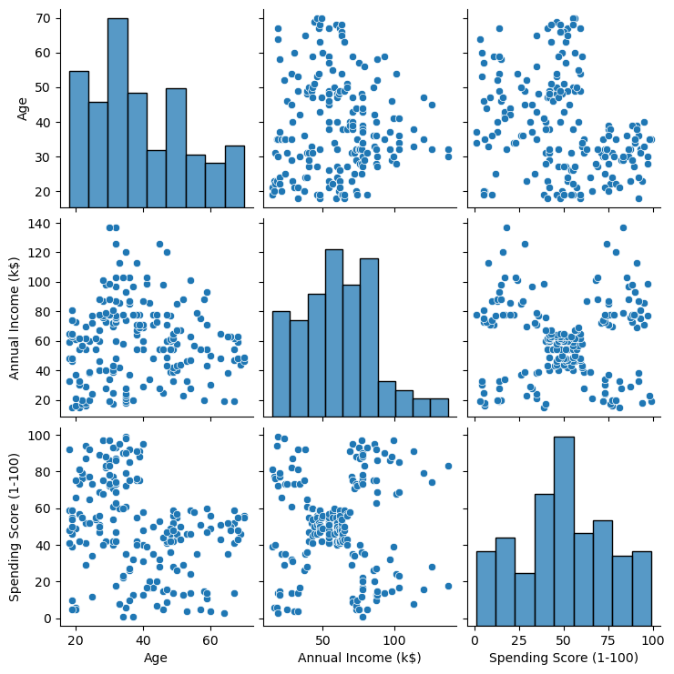
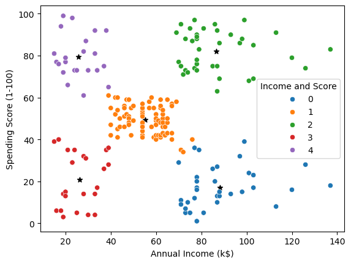

# Overview

Stake holders wants to identify the most important shopping groups based on income
, age, and the mall shopping score. They want the optimal ammount of groups labeled so the
marketing team can plan a strategy.

## ⚙️ Requirements
 
- Python ≥ 3.8  
- pandas  
- numpy  
- matplotlib  
- seaborn  
- scikit-learn  
- jupyter

## [Data](Data/) 📁

### 📄 [Mall Customers](Data/Mall_Customers.csv)
**Description:** csv file with CustomerID, Gender, Age, Annual Income (k$), Spending Score (1-100) of customers.

## [Open In Colab 📝](https://colab.research.google.com/github/Fabian-Urbina/Data-Analysis-Projects/blob/main/Mall%20Customers%20Project/Mall_Customers.ipynb)

## Plots
## 
## 